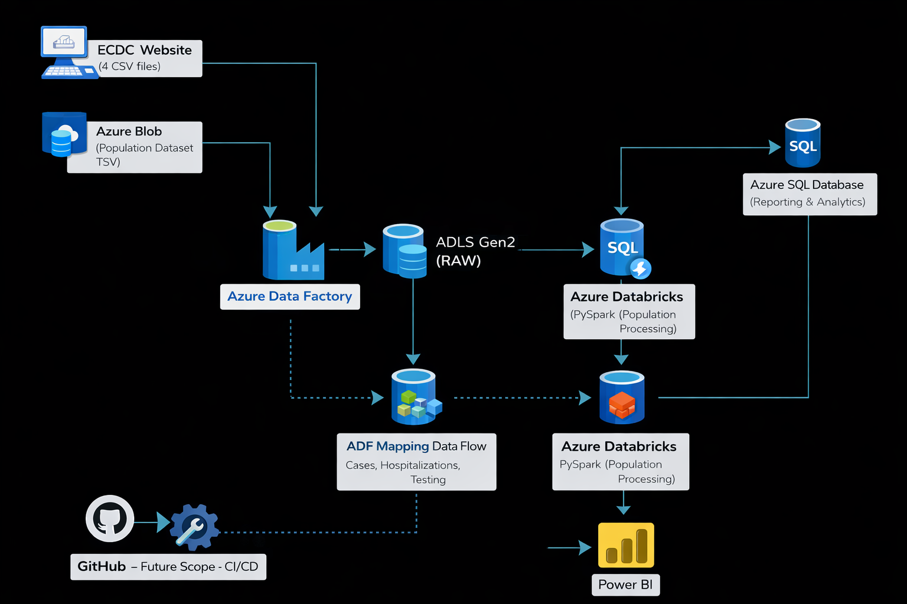
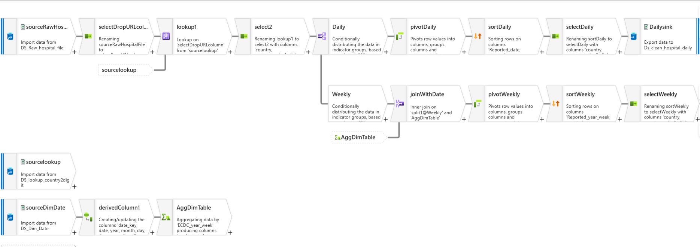
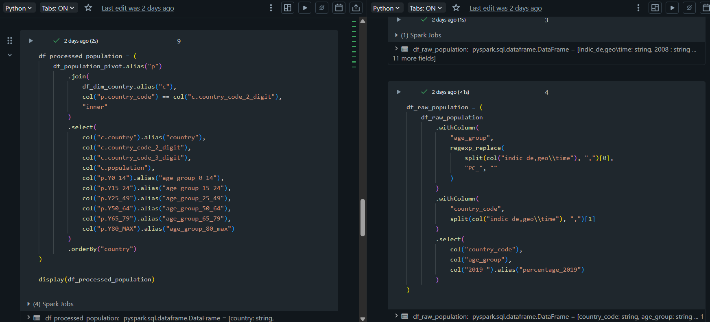
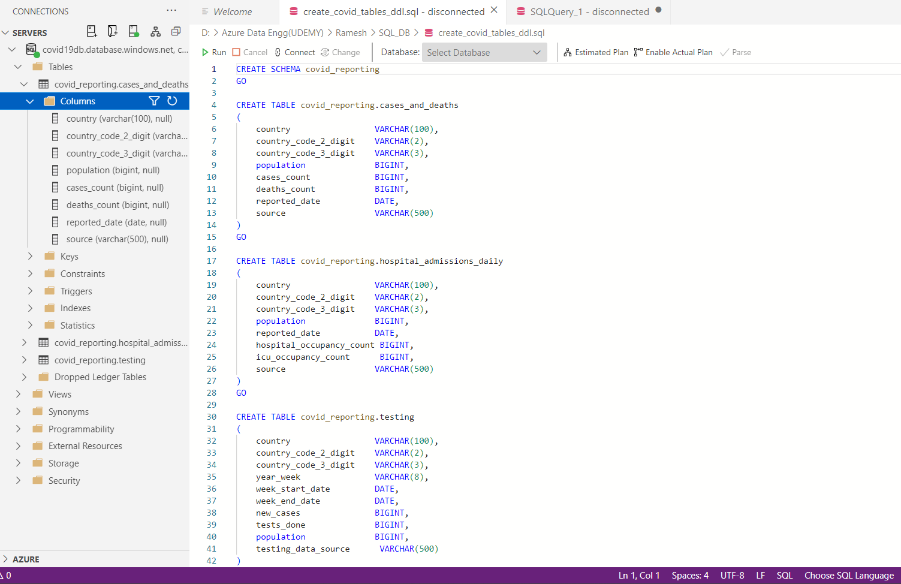
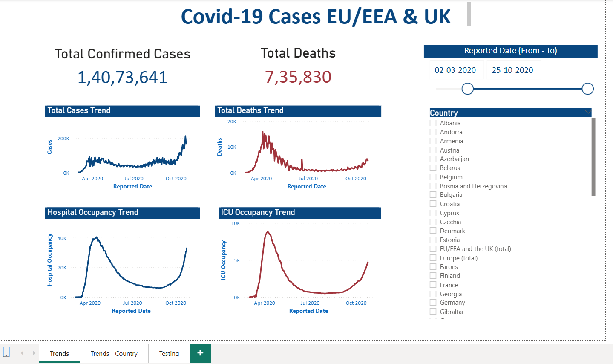

# COVID-19 Data Engineering Pipeline (Azure)

## 📌 Project Overview
This project demonstrates an **end-to-end Azure Data Engineering pipeline** built to ingest, transform, store, and analyze COVID-19 data for reporting and analytics use cases.

The solution follows **industry best practices** by separating raw and curated data layers, using scalable cloud services, and enabling downstream consumption for **BI analytics and machine learning**.

---

## 🏗️ Architecture Overview

### High-level Flow:
1. Data ingestion from public sources and blob storage
2. Raw data storage in ADLS Gen2
3. Data transformation using ADF Mapping Data Flows and Databricks (PySpark)
4. Curated data storage in ADLS Gen2 (Clean layer)
5. Analytical tables loaded into Azure SQL Database
6. Interactive reporting using Power BI

---

## 📊 Data Sources
- **ECDC COVID-19 datasets** (CSV files)
  - Cases & deaths
  - Hospital admissions
  - Testing data
- **Population dataset** (TSV format)

---

## 🔧 Technologies Used

| Layer | Tools |
|------|------|
| Orchestration | Azure Data Factory |
| Storage | Azure Data Lake Storage Gen2 |
| Transformation | ADF Mapping Data Flows, Azure Databricks (PySpark) |
| Analytics DB | Azure SQL Database |
| Visualization | Power BI |
| Language | PySpark, SQL |
| Version Control | GitHub |

---

## 🔄 Data Pipeline Details

### 1️⃣ Ingestion (ADF)
- Extracted multiple CSV files from ECDC website
- Ingested population TSV data from Azure Blob Storage
- Stored all datasets in **Raw zone** of ADLS Gen2

---

### 2️⃣ Transformation (ADF Data Flows)
- Country code normalization using lookup datasets
- Daily and weekly aggregations
- Pivoting indicators into analytical columns
- Sorting and standardization of reporting dates

---

### 3️⃣ Transformation (Databricks – PySpark)
- Population dataset processed using PySpark
- Age group parsing and normalization
- Country code enrichment using dimension tables
- Output written to **Clean zone** in ADLS Gen2

---

### 4️⃣ Analytics Layer (Azure SQL Database)
- Designed analytics-friendly schema
- Created tables for:
  - Cases and deaths
  - Hospital admissions (daily)
  - Testing data (weekly)
- Loaded clean data from ADLS Gen2 using ADF

---

### 5️⃣ Reporting (Power BI)
- Connected Power BI to Azure SQL Database
- Built interactive dashboards:
  - Total cases & deaths trends
  - Hospital and ICU occupancy
  - Country-wise filtering
  - Date range analysis

---

## 📈 Key Features
- Modular and scalable pipeline design
- Clear separation of raw and curated data layers
- Combination of **low-code (ADF)** and **code-based (PySpark)** transformations
- Analytics-ready data model for BI consumption
- Designed for future CI/CD and ML integration
- 🔐 Security Note:
All credentials and secrets are excluded from this repository and are expected to be provided via environment variables or secure secret management services.

---

## 🚀 Future Enhancements
- Implement CI/CD using Azure DevOps
- Parameterized deployments across Dev/Test/Prod
- Incremental data loading
- Data quality checks and monitoring
- Integration with ML pipelines

---

## 👤 Author
**Roshan Fareed N**  
Data Engineer (Aspiring)  
- LinkedIn: https://linkedin.com/in/roshanfareed53
- GitHub: https://github.com/ROSHANFAREED

---

## 📜 License
This project is licensed under the **MIT License**.
